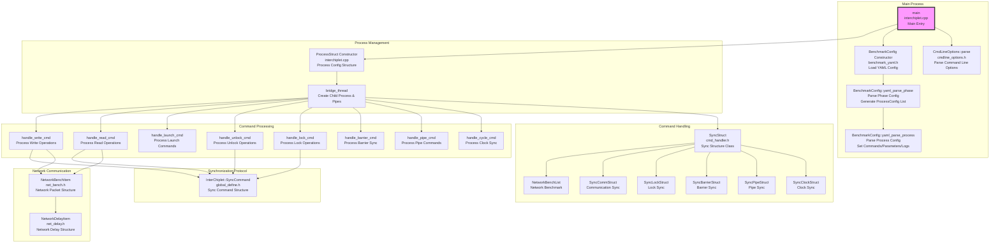

```mermaid
graph TD
    subgraph Main Process
        A[main<br>interchiplet.cpp<br>Main Entry] --> B[CmdLineOptions::parse<br>cmdline_options.h<br>Parse Command Line Options]
        A --> C[BenchmarkConfig Constructor<br>benchmark_yaml.h<br>Load YAML Config]
        
        C --> D[BenchmarkConfig::yaml_parse_phase<br>Parse Phase Config<br>Generate ProcessConfig List]
        D --> E[BenchmarkConfig::yaml_parse_process<br>Parse Process Config<br>Set Commands/Parameters/Logs]
    end
    
    subgraph Process Management
        A --> F[ProcessStruct Constructor<br>interchiplet.cpp<br>Process Config Structure]
        F --> G[bridge_thread<br>Create Child Process & Pipes]
    end
    
    subgraph Command Handling
        G --> H[SyncStruct<br>cmd_handler.h<br>Sync Structure Class]
        H --> I[SyncClockStruct<br>Clock Sync]
        H --> J[SyncPipeStruct<br>Pipe Sync]
        H --> K[SyncBarrierStruct<br>Barrier Sync]
        H --> L[SyncLockStruct<br>Lock Sync]
        H --> M[SyncCommStruct<br>Communication Sync]
        H --> N[NetworkBenchList<br>Network Benchmark]
    end
    
    subgraph Command Processing
        G --> O[handle_cycle_cmd<br>Process Clock Sync]
        G --> P[handle_pipe_cmd<br>Process Pipe Commands]
        G --> Q[handle_barrier_cmd<br>Process Barrier Sync]
        G --> R[handle_lock_cmd<br>Process Lock Operations]
        G --> S[handle_unlock_cmd<br>Process Unlock Operations]
        G --> T[handle_launch_cmd<br>Process Launch Commands]
        G --> U[handle_read_cmd<br>Process Read Operations]
        G --> V[handle_write_cmd<br>Process Write Operations]
    end
    
    subgraph Network Communication
        U --> W[NetworkBenchItem<br>net_bench.h<br>Network Packet Structure]
        V --> W
        W --> X[NetworkDelayItem<br>net_delay.h<br>Network Delay Structure]
    end
    
    subgraph Synchronization Protocol
        R --> Y[InterChiplet::SyncCommand<br>global_define.h<br>Sync Command Structure]
        S --> Y
        U --> Y
        V --> Y
    end

    style A fill:#f9f,stroke:#333,stroke-width:4px
```