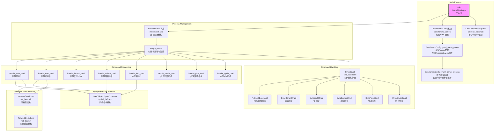

```mermaid
graph TD
    subgraph Main Process
        A[main<br>interchiplet.cpp<br>主入口] --> B[CmdLineOptions::parse<br>cmdline_options.h<br>解析命令行选项]
        A --> C[BenchmarkConfig构造<br>benchmark_yaml.h<br>加载YAML配置]
        
        C --> D[BenchmarkConfig::yaml_parse_phase<br>解析phase配置<br>生成ProcessConfig列表]
        D --> E[BenchmarkConfig::yaml_parse_process<br>解析进程配置<br>设置命令/参数/日志等]
    end
    
    subgraph Process Management
        A --> F[ProcessStruct构造<br>interchiplet.cpp<br>进程配置结构]
        F --> G[bridge_thread<br>创建子进程与管道]
    end
    
    subgraph Command Handling
        G --> H[SyncStruct<br>cmd_handler.h<br>同步结构体类]
        H --> I[SyncClockStruct<br>时钟同步]
        H --> J[SyncPipeStruct<br>管道同步]
        H --> K[SyncBarrierStruct<br>屏障同步]
        H --> L[SyncLockStruct<br>锁同步]
        H --> M[SyncCommStruct<br>通信同步]
        H --> N[NetworkBenchList<br>网络基准测试]
    end
    
    subgraph Command Processing
        G --> O[handle_cycle_cmd<br>处理时钟同步]
        G --> P[handle_pipe_cmd<br>处理管道命令]
        G --> Q[handle_barrier_cmd<br>处理屏障同步]
        G --> R[handle_lock_cmd<br>处理锁操作]
        G --> S[handle_unlock_cmd<br>处理解锁操作]
        G --> T[handle_launch_cmd<br>处理启动命令]
        G --> U[handle_read_cmd<br>处理读操作]
        G --> V[handle_write_cmd<br>处理写操作]
    end
    
    subgraph Network Communication
        U --> W[NetworkBenchItem<br>net_bench.h<br>网络包结构]
        V --> W
        W --> X[NetworkDelayItem<br>net_delay.h<br>网络延迟结构]
    end
    
    subgraph Synchronization Protocol
        R --> Y[InterChiplet::SyncCommand<br>global_define.h<br>同步命令结构]
        S --> Y
        U --> Y
        V --> Y
    end

    style A fill:#f9f,stroke:#333,stroke-width:4px
```